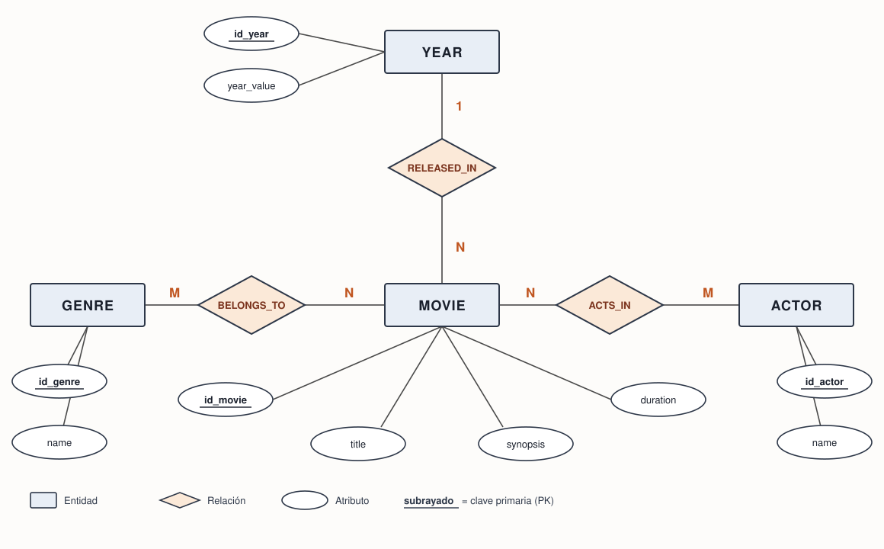
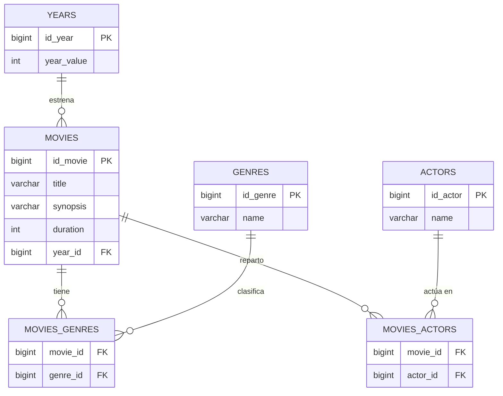

# movies-api

API REST de películas construida con Spring Boot 4 y JPA, con base de datos H2 en memoria.

> Ejercicio del bootcamp de Factoría F5 (P5 Digital Academy).

## Stack

- Java 21
- Spring Boot 4.1.1 (Web MVC, Data JPA, Validation)
- H2 (en memoria)
- Maven

## Modelo de datos

Cuatro tablas principales — `movies`, `genres`, `actors` y `years` — más dos tablas intermedias
para resolver las relaciones N:M.

| Relación | Cardinalidad | Cómo se implementa |
|---|---|---|
| Película → Año | N:1 | FK `year_id` en la tabla `movies` |
| Película ↔ Género | N:M | tabla intermedia `movies_genres` |
| Película ↔ Actor | N:M | tabla intermedia `movies_actors` |

Una película se estrena en un único año, pero en un año se estrenan muchas películas, así que la FK
vive en el lado N. Una película puede ser de varios géneros y un género agrupa muchas películas, y lo
mismo ocurre con los actores: ahí no hay sitio para una FK y hace falta una tabla intermedia.

### Diagrama entidad-relación (Chen)

### Diagrama de patas de gallo (crow's foot)

## Instalación

_(pendiente)_

## Endpoints

_(pendiente)_
