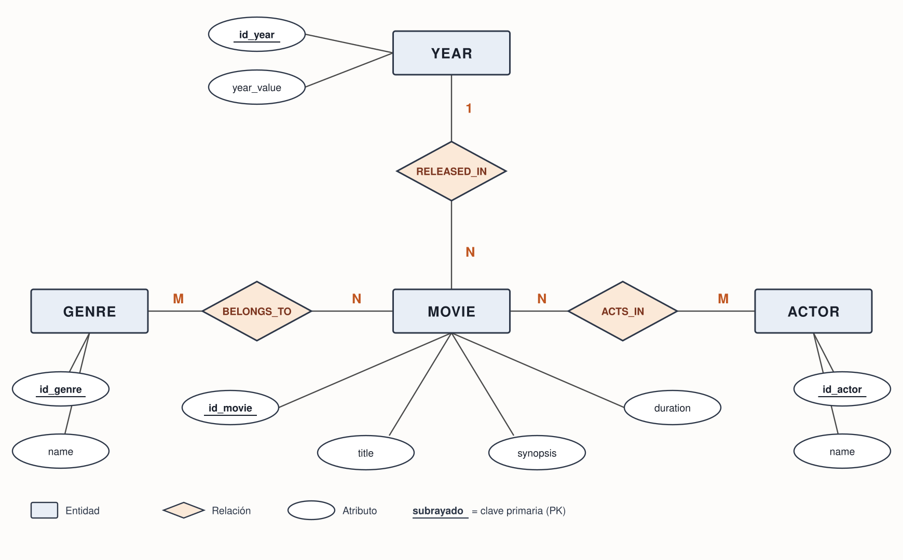
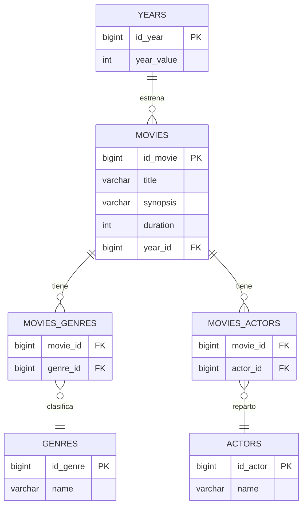

# movies-api

API REST de películas hecha con Spring Boot y JPA. Gestiona un catálogo con sus géneros,
actores y año de estreno, sobre una base de datos H2 en memoria.

Ejercicio del curso de Java y Spring de Factoría F5 (P5 Digital Academy).

## Stack

- Java 21
- Spring Boot 4.1.1 (Web MVC, Data JPA, Validation)
- H2 en memoria
- Maven

## Puesta en marcha

Requisitos: Java 21. Maven no hace falta, el proyecto trae el wrapper.

```bash
git clone https://github.com/IulianDev27/movies-api.git
cd movies-api
./mvnw spring-boot:run
```

La API queda en `http://localhost:8080`. Al arrancar, Hibernate crea las tablas a partir de las
entidades y `data.sql` carga tres películas de ejemplo con sus géneros y actores.

Para ejecutar los tests:

```bash
./mvnw test
```

### Consola de base de datos

Con la aplicación levantada, `http://localhost:8080/h2-console` abre la consola de H2:

| Campo | Valor |
|---|---|
| JDBC URL | `jdbc:h2:mem:moviesdb` |
| User Name | `sa` |
| Password | (vacío) |

La base es en memoria, así que se recrea en cada arranque y los datos de prueba vuelven a estar ahí.

## Endpoints

Todos cuelgan de `/api/v1/movies`.

| Método | Ruta | Qué hace | Respuesta |
|---|---|---|---|
| GET | `/api/v1/movies` | Lista todas las películas | 200 |
| GET | `/api/v1/movies/{id}` | Devuelve una película | 200, o 404 si no existe |
| GET | `/api/v1/movies/search?title=&genre=` | Busca por título o por género | 200, o 400 si no se indica ninguno |
| POST | `/api/v1/movies` | Crea una película | 201, o 400 si el cuerpo no es válido |
| PUT | `/api/v1/movies/{id}` | Actualiza una película | 200, 400 o 404 |
| DELETE | `/api/v1/movies/{id}` | Borra una película | 204, o 404 si no existe |

La búsqueda acepta coincidencias parciales y no distingue mayúsculas: `?title=matr` encuentra Matrix.
Si se envían los dos parámetros, manda el título.

### Cuerpo de la petición

`POST` y `PUT` esperan este JSON. `genreIds` y `actorIds` son ids que ya existen en la base de datos:

```json
{
  "title": "El Padrino",
  "synopsis": "La familia Corleone.",
  "duration": 175,
  "yearId": 1,
  "genreIds": [2],
  "actorIds": [2]
}
```

Validaciones: `title` no puede ir vacío y `duration` tiene que ser mayor que cero.

### Cuerpo de la respuesta

Los géneros y actores salen resueltos por nombre, no por id:

```json
{
  "id": 1,
  "title": "Matrix",
  "synopsis": "Un hacker descubre que la realidad es una simulacion.",
  "duration": 136,
  "year": 1999,
  "genres": ["Accion", "Ciencia ficcion"],
  "actors": ["Keanu Reeves"]
}
```

### Ejemplos

```bash
# todas
curl http://localhost:8080/api/v1/movies

# una
curl http://localhost:8080/api/v1/movies/1

# por título
curl "http://localhost:8080/api/v1/movies/search?title=matr"

# por género
curl "http://localhost:8080/api/v1/movies/search?genre=drama"

# crear
curl -X POST http://localhost:8080/api/v1/movies \
  -H "Content-Type: application/json" \
  -d '{"title":"El Padrino","synopsis":"La familia Corleone.","duration":175,"yearId":1,"genreIds":[2],"actorIds":[2]}'

# actualizar
curl -X PUT http://localhost:8080/api/v1/movies/1 \
  -H "Content-Type: application/json" \
  -d '{"title":"Matrix Reloaded","synopsis":"La segunda parte.","duration":138,"yearId":2,"genreIds":[1],"actorIds":[1]}'

# borrar
curl -X DELETE http://localhost:8080/api/v1/movies/1
```

### Errores

Los errores devuelven JSON. Una película que no existe:

```json
{ "error": "Pelicula no encontrada: id=999" }
```

Un cuerpo inválido devuelve un mensaje por cada campo que falla:

```json
{
  "title": "El titulo es obligatorio",
  "duration": "La duracion debe ser mayor que cero"
}
```

## Modelo de datos

Cuatro tablas principales (`movies`, `genres`, `actors` y `years`) más dos tablas intermedias
para las relaciones N:M.

| Relación | Cardinalidad | Cómo se implementa |
|---|---|---|
| Película a año | N:1 | FK `year_id` en la tabla `movies` |
| Película a género | N:M | tabla intermedia `movies_genres` |
| Película a actor | N:M | tabla intermedia `movies_actors` |

Una película se estrena en un único año y en un año se estrenan muchas películas, así que la FK vive
en el lado N. Una película puede ser de varios géneros y un género agrupa muchas películas, y lo mismo
pasa con los actores: ahí no cabe una FK y hace falta una tabla puente.

### Diagrama entidad-relación (Chen)



Modelo conceptual: los rombos son relaciones, las elipses atributos y el subrayado marca la PK.
Las N:M se representan con un rombo, sin tabla intermedia.

### Diagrama de patas de gallo

Modelo físico, con las tablas tal y como existen en la base de datos:



## Estructura del proyecto

El código se organiza por feature, no por capa: todo lo de películas vive junto.

```
src/main/java/com/movies/api/
├── movie/
│   ├── MovieEntity.java
│   ├── MovieRepository.java
│   ├── MovieMapper.java
│   ├── InterfaceMovieService.java
│   ├── MovieServiceImpl.java
│   ├── MovieController.java
│   ├── dtos/
│   │   ├── MovieDTORequest.java
│   │   └── MovieDTOResponse.java
│   └── exceptions/
│       ├── MovieException.java
│       └── MovieExceptionNotFound.java
├── genre/
├── actor/
├── year/
└── globals/
    └── GlobalExceptionHandler.java
```

Reparto de responsabilidades:

- La entidad mapea la tabla y no lleva lógica de negocio.
- El repositorio extiende `JpaRepository`. Las consultas de búsqueda se derivan del nombre del método.
- El mapper traduce entidad a DTO de respuesta.
- El servicio tiene la lógica: resuelve las relaciones por id y lanza las excepciones de dominio.
- El controller recibe la petición, delega y devuelve el código HTTP.
- `GlobalExceptionHandler` convierte cada excepción en su respuesta JSON con su código.

Las entidades nunca salen por la API. Lo que entra y lo que sale son DTOs.

## Autor

Iulian Timofei. [github.com/IulianDev27](https://github.com/IulianDev27)
